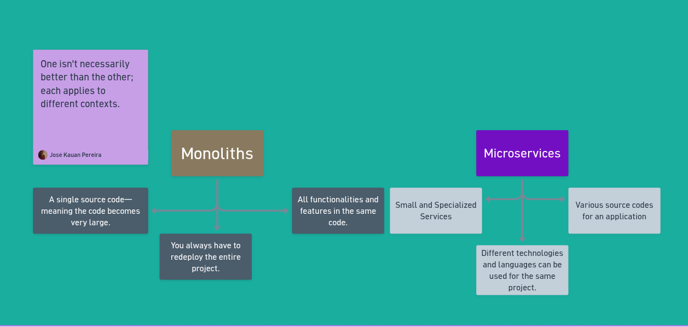
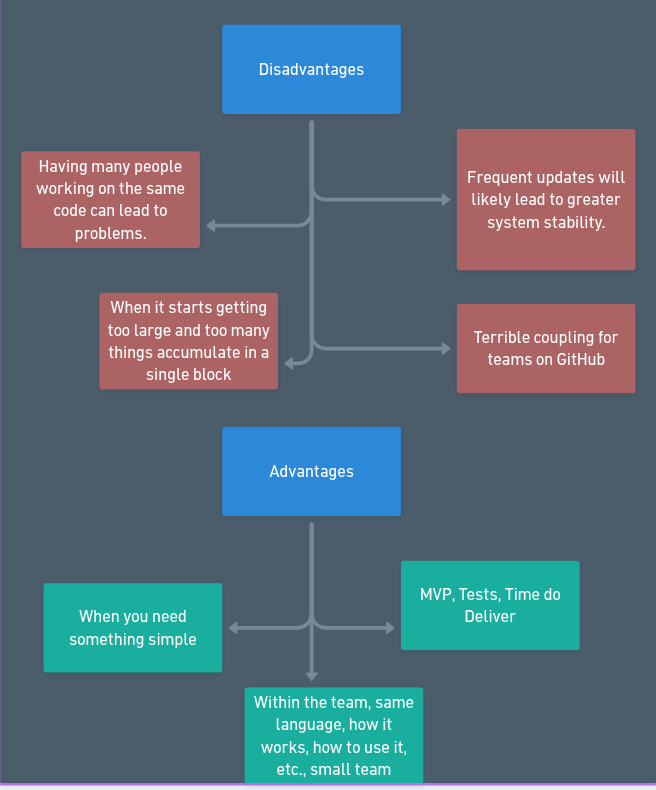
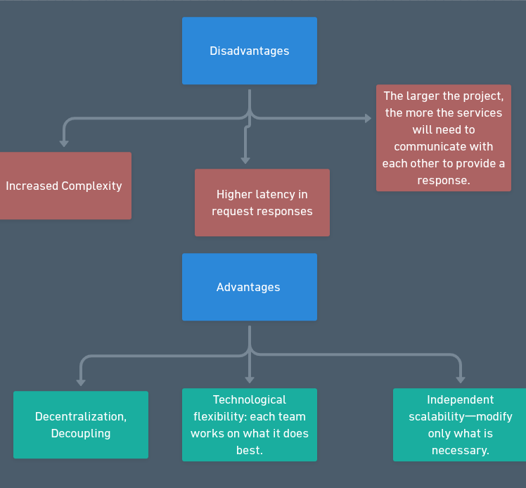
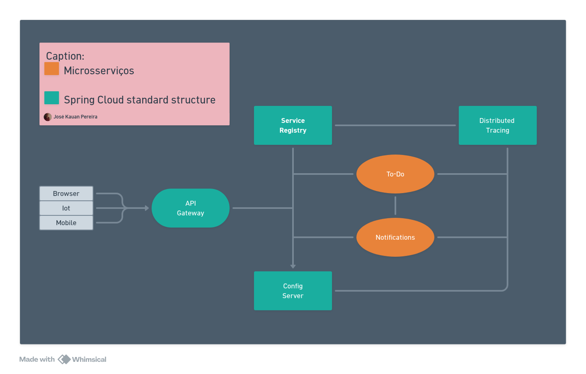
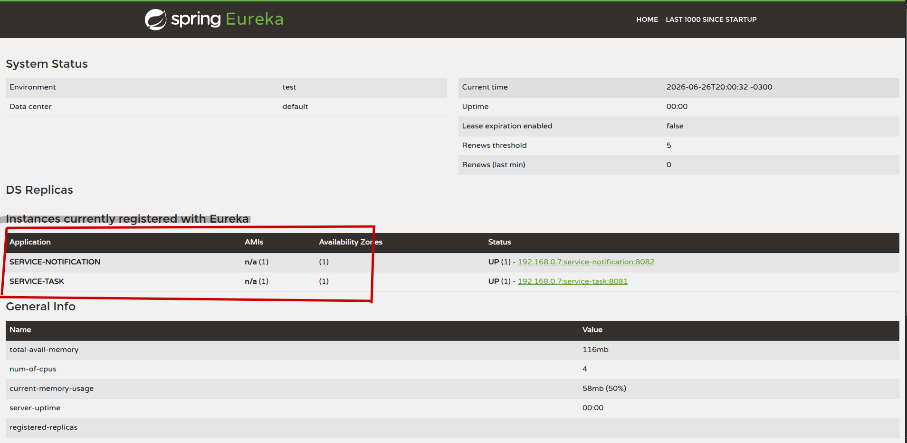

# BackEndSpringCloud

## Overview

&emsp;This project is a backend built with Spring Boot and Spring Cloud. It serves as the main application to provide REST APIs, integrate services, and configure common microservice dependencies.


## Microservices vs Monoliths



&emsp;A **Monolithic Architecture** gathers all components of an application into a single deployment unit. Code, business logic, UI and data access run together in a single process and usually in a single application.

&emsp;A **Microservices Architecture** splits the application into smaller services, each with a specific responsibility. These services operate independently, communicate via APIs or messages, and can run in separate processes.

&emsp;The main difference lies in organization and lifecycle: in the **monolith**, *all parts of the application share the same environment and deployment*; in **microservices**, *each service has clear boundaries and is treated as an independent piece within the system.*

#### Advantages and Disadvantages of Monolithic Architecture



&emsp;The monolithic architecture brings all application components into a single codebase and process. This has some important advantages and disadvantages to consider.

- ***Advantages***:
  - **Development simplicity:** easier to start and test locally with a single project.
  - **Single deployment:** the entire application is packaged and deployed as a unit, reducing release complexity.
  - **Less operational overhead:** no need for orchestration of multiple services, discovery, or inter-process communication.
  - **Transactional consistency:** transactions and data access are more straightforward when everything is in the same context.

- ***Disadvantages***:
  - **Limited scalability:** you can't scale only specific parts; the entire application must be scaled together.
  - **Heavier deployment cycle:** a small change requires rebuilding and redeploying the whole monolith.
  - **High coupling:** internal components can become tightly dependent on each other, making maintenance harder.
  - **Broad failure risk:** a failure in one module can affect the entire application and impact all users.

#### Advantages and Disadvantages of Microservices Architecture



&emsp;Microservices architecture brings clear benefits, but also important challenges to consider.

- ***Advantages***:
  - **Independent scalability:** each service can be scaled according to demand without scaling the entire application.
  - **Independent evolution:** teams can develop, test and deploy services separately.
  - **Resilience:** failures in one service have less impact on the system as a whole, provided there are fault-tolerance mechanisms.
  - **Technological flexibility:** different services can use different stacks and languages when needed.
- ***Disadvantages***:
  - **Operational complexity:** orchestrating, monitoring and deploying multiple services requires additional tools and best practices.
  - **Inter-service communication:** exchanging data over the network introduces latency and may require patterns like API Gateway, circuit breaker and retry.
  - **Harder testing:** testing integrations between services requires distributed scenarios and more complex environments.
  - **Data management:** maintaining consistency and transactions between independent services is more complex than in a monolith.

## System Architecture (Microservices)



&emsp;The image shows the basic architecture of the project with services organized in layers and *communicating independently*. <br>
&emsp;The main backend exposes **REST** APIs, centralizes business rules and orchestrates execution among microservices. Auxiliary services, such as **notifications** and **tasks**, are isolated in their own instances and rely on a *discovery server or gateway to be located*. This structure makes it easier to scale and deploy each service separately while keeping the data flow consistent across the **different parts of the system**.

- For more details you can check [Cloud](https://spring.io/cloud)

- For Spring Cloud Config documentation [Doc](https://docs.spring.io/spring-cloud-config/docs/4.0.5/reference/html/#_quick_start)


## Instances of Services (Service-notification and Tasks)



&emsp;Each service runs in its own instance and on a different port without directly interfering with the other's operation, as can be seen on localhost port 8888, with each service running independently on separate ports: service-notification:8082 and service-task:8081


## Technologies

- Java 17+ (or project-compatible version)
- Spring Boot
- Spring Cloud
- Maven
- Docker (optional)

## Prerequisites

Before using the software, make sure you have installed:

- Java JDK 17 or higher
- Maven 3.6+ or higher
- Git
- Docker and Docker Compose (if you want to run in containers)
- If you want to use locally change in each service properties "service-main" to localhost

## How to use

### Step 1: Clone the repository

Open the terminal and run:

```bash
git clone <URL_DO_REPOSITORIO>
cd BackEndSpringCloud
```

> Replace `<URL_DO_REPOSITORIO>` with the remote repository URL.

### Step 2: Build the project

In the project root directory, run:

```bash
mvn clean install
```

This command compiles the code, runs tests, and generates the backend artifact.

### Step 3: Configure environment variables

Some Spring Cloud applications use environment variables or `application.yml`/`application.properties` files for configuration.

Example of common variables:

```bash
export SPRING_PROFILES_ACTIVE=local
export SERVER_PORT=8080
export SPRING_DATASOURCE_URL=jdbc:mysql://localhost:3306/nome_do_banco
export SPRING_DATASOURCE_USERNAME=usuario
export SPRING_DATASOURCE_PASSWORD=senha
```

Adjust the values according to your local setup.

### Step 4: Run the application

To start the application directly, use:

```bash
mvn spring-boot:run
```

Or run the generated jar:

```bash
java -jar target/*.jar
```

&emsp;The application will be available at `http://localhost:8080` by default, unless the port is changed.

## Recommended README structure

### Basic endpoints

&emsp;To know which endpoints are available, check the project controllers. In general, Spring Boot services expose routes such as:

- `GET /api/usuarios`
- `POST /api/usuarios`
- `GET /api/produtos`

Documentation may be available at `http://localhost:8080/swagger-ui.html` if Swagger is configured.

### Health check

In many Spring Boot projects, there is a health endpoint:

- `GET /actuator/health`

### Spring Cloud configuration

If the project uses Spring Cloud Config or Eureka, check:

- `application.yml` for `spring.cloud.config` or `eureka.client` settings
- whether a remote config server or discovery server is required

## Use with Docker (optional)

If the project has a `Dockerfile`, you can create an image with:

```bash
docker build -t backend-spring-cloud .
```

And run with:

```bash
docker run -p 8080:8080 backend-spring-cloud
```

If there is `docker-compose.yml`, use:

```bash
docker-compose up --build
```

## Tests

To run automated tests:

```bash
mvn test
```

## Usage tips

- Check the `pom.xml` file for specific Spring Cloud dependencies.
- Adjust environment profiles in `application-{profile}.yml` for development, staging, and production.
- Use `mvn spring-boot:run -Dspring-boot.run.profiles=local` to start with local profile.
- Monitor logs in the terminal to detect startup or database connection errors.

## Final remarks

This README describes the general use of a Spring Cloud backend. For project-specific information, consult the configuration files and existing documentation in the source code.
